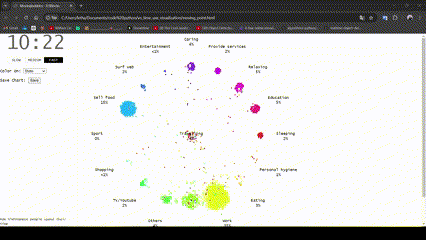

# Vietnam time use visualization

## Introduction

Here is my python source code for visualizing how Vietnamese people spend their time.

## Dataset

VN Time-Use Survey 2022: https://microdata.worldbank.org/index.php/catalog/5844

**GEOGRAPHIC COVERAGE** 

The survey covered the following socio-economic regions:
* North
* Red River Delta
* Coastal
* Central Highlands
* Southeast
* Mekong River Delta

## Result
By running the sript **main.py**, we will have following output:

   
  <i>Vietnam time use</i>

## Requirements

* **pandas 2.2.2**
* **d3blocks 1.4.11** 
